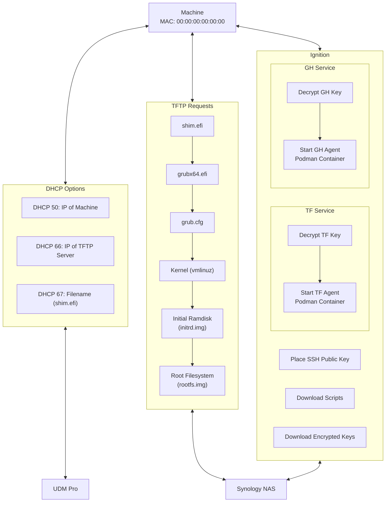

# UEFI-PXE-SB-AGENTS

## Overview

This project exists to guide users through the process of bootstrapping machines from bare-metal to fully-authenticated container-based agents using basic networking protocols and hardware authentication.

This is one solution to a problem commonly referred to as the [Secret Zero Dilemma](https://www.hashicorp.com/resources/starbucks-secrets-at-the-retail-edge-with-hashicorp-vault).

Once initial setup is complete, a new machine can be provisioned to communicate with services such as GitHub Actions or Terraform Cloud in minutes, all running directly from RAM.

The bootstrapping process is outlined in the following diagram, assuming that a UDM Pro is used for DHCP and a Synology NAS is used for serving the TFTP and HTTP requests:

## UEFI and SecureBoot

Provided in this repository are `shim.efi` and `grubx64.efi`, pulled from yum on an x86_64 Fedora 39 container. No other linux distributions have been tested with these files, and you may encounter issues with SecureBoot if you use another distro.

I am uncertain of the redistribution rights of these binaries, given that they are open-source but owned by RedHat. @redhat, ping me if they need to be removed. These binaries are signed by Microsoft, which is why they work with SecureBoot. I did not have any luck compiling them myself, however the projects responsible for their maintenance are:

    - shim: https://github.com/rhboot/shim
    - grub: https://git.savannah.gnu.org/cgit/grub.git
    - Fedora CoreOS: https://github.com/coreos/fedora-coreos-config
    
## TFTP

The process for setting up TFTP varies on different hardware/software, but has a few consistent settings that remain consistent across implementations. The settings may look different between hardware, but the underlying principles remain. For a Synology Diskstation, you'll need to create a file share (I named mine `pxeboot`) and populate it with the contents of this repository, and place the Fedora 39 ISO in the `isos` folder.

Under `Control Panel -> File Services -> Advanced`, you'll need to designate this file share as your TFTP root and enable read-only access across the network:

Once those settings are established, you'll need to set up HTTP file access to the same directory

## HTTP

You can host these files anywhere, however I found it to be easiest to just tack another Synology service on to the same file share.

Under `Web Station -> Web Service`, create a web service that points to the pxeboot share:

You'll then need to create a web portal that corresponds to this service.

Under `Web Station -> Web Portal`, create an HTTP portal pointing to the previously made Web Service. You'll need to specify a port different from the default. For this example, I've chosen 9876.

Once established, you should be able to access the files in the pxeboot file share through a browser request.

Note: HTTP is used because Ignition throws errors with self-signed certs when retrieving files.

## DHCP

The same principle of uncertainty goes for DHCP servers as it does with TFTP servers. In short, you'll need to update your DHCP settings to serve two values:
1. Option 66: The IP of your TFTP Server
1. Option 67: The file that PXE machines should boot from that server

On a UDM Pro, the settings appear like this:

Inside of the settings for a particular network, you'll need to check the Network Boot flag, specify the IP of the TFTP server, and specify shim.efi as the file name. You will also need to check the TFTP Server box, and again enter the IP of the TFTP server.
