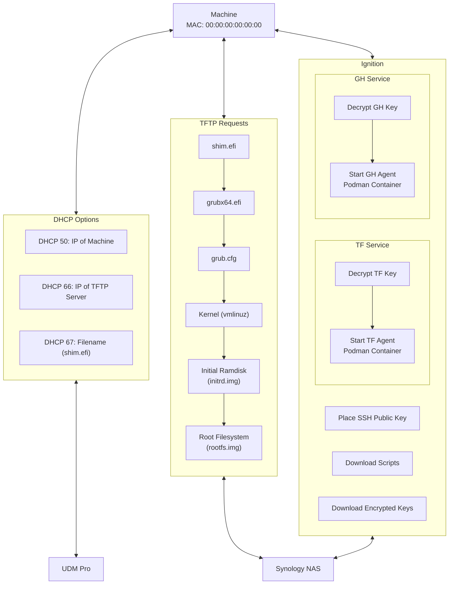
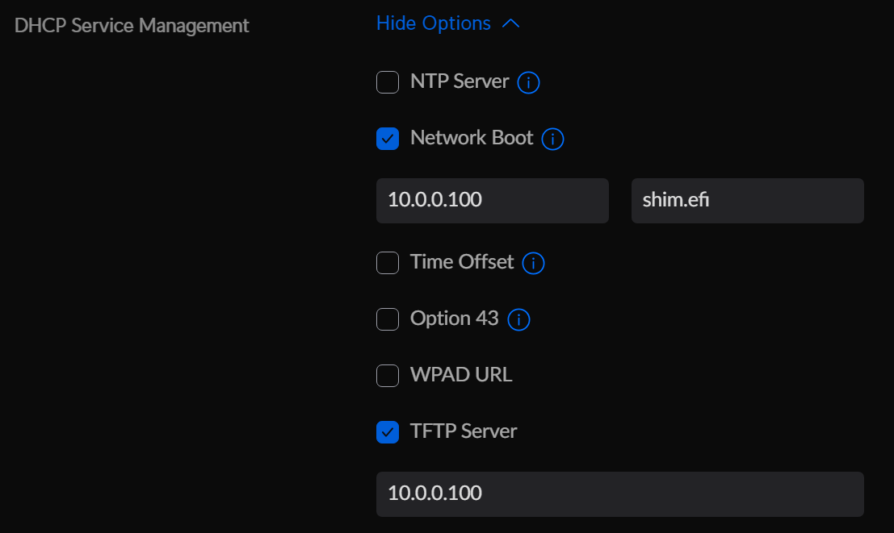

# UEFI-PXE-AGENTS

<!-- TOC start (generated with https://github.com/derlin/bitdowntoc) -->

 - [Overview](#overview)
 - [UEFI and SecureBoot](#uefi-and-secureboot)
 - [TFTP](#tftp)
 - [HTTP](#http)
 - [DHCP](#dhcp)
 - [Machine Prep](#machine-prep)
 - [Conclusion](#conclusion)

<!-- TOC end -->

<!-- TOC --><a name="overview"></a>
## Overview

This project exists to guide users through the process of bootstrapping machines from bare-metal to fully-authenticated container-based agents using basic networking protocols and hardware authentication.

This is one solution to a problem commonly referred to as the [Secret Zero Dilemma](https://www.hashicorp.com/resources/starbucks-secrets-at-the-retail-edge-with-hashicorp-vault).

Once initial setup is complete, a new machine can be provisioned to securely communicate with services such as GitHub Actions or Terraform Cloud in minutes, all running directly from RAM.

The bootstrapping process is outlined in the following diagram, assuming that a UDM Pro is used for DHCP and a Synology NAS is used for serving the TFTP and HTTP requests:



<!-- TOC --><a name="uefi-and-secureboot"></a>
## UEFI and SecureBoot

Provided in this repository are `shim.efi` and `grubx64.efi`, pulled with yum on an x86_64 Fedora 39 container. No other linux distributions have been tested with these files, and you may encounter issues with SecureBoot if you use another distro, as grub checks the certificate of the kernel before booting. This process is described in this article: https://access.redhat.com/articles/5254641

To retrieve these files on your own, you can refer to this guide from RedHat: https://www.redhat.com/sysadmin/pxe-boot-uefi

The process is intended for RHEL, but works with Fedora as well. I've modified and consolidated these steps here:

On a machine with podman (or docker):
```bash
# Start and attach to a Fedora container
podman run -it --rm --name fedora fedora:latest
```

Inside of the container:
```bash
# Change to an empty directory
cd tmp/

# Check for package updates
yum check-update

# Install shim (which also installs grub2 as a dependency)
yum install -y shim-x64.x86_64
```

In a new terminal on the host machine:
```bash
# Copy shim.efi to the host machine
podman cp fedora:/boot/efi/EFI/fedora/shim.efi .

# Copy grubx64.efi to the host machine
podman cp fedora:/boot/efi/EFI/fedora/grubx64.efi .
```

The shim and grub efi files should now exist in your current directory on the host machine.

I am uncertain of the redistribution rights of these binaries, given that they are open-source but owned by RedHat. @redhat, ping me if they need to be removed. These binaries are signed by Microsoft, which is why they work with SecureBoot. I did not have any luck compiling them myself, however the projects responsible for their maintenance are:

 - shim: https://github.com/rhboot/shim
 - grub: https://git.savannah.gnu.org/cgit/grub.git
 - Fedora CoreOS: https://github.com/coreos/fedora-coreos-config
    
<!-- TOC --><a name="tftp"></a>
## TFTP

The process of setting up TFTP varies depending on hardware/software, but settings remain consistent across implementations. For a Synology Diskstation, you'll need to create a file share (I named mine `pxeboot`) and populate it with the contents of this repository, and place the Fedora ISO in the `isos` folder.

Under `Control Panel -> File Services -> Advanced`, you'll need to designate this file share as your TFTP root and enable read-only access across the network:


Within the share, you'll then need to mount an ISO to boot. Start by creating a folder under `/mounts`; for this example, we'll call the folder `fcos-39`.

Navigate to `/isos`, and upload your ISO if you haven't already.

Right-click on the ISO, and select `Mount Virtual Drive`.


Browse to the `/mounts/fcos-39` folder and select the `Mount automatically on startup` checkbox.


At this point, the TFTP setup is complete. For ignition to work, you'll need to set up HTTP file access to the same share.

<!-- TOC --><a name="http"></a>
## HTTP

You can host these files anywhere, however I found it to be easiest to just tack another Synology service on to the same file share.

Under `Web Station -> Web Service`, create a web service that points to the pxeboot share:


You'll then need to create a web portal that corresponds to this service.

Under `Web Station -> Web Portal`, create an HTTP portal pointing to the previously made Web Service. You'll need to specify a port different from the default. For this example, I've chosen 9876.


Once established, you should be able to access the files in the pxeboot file share through a browser request.

Example: http://10.0.0.100:9876/ignition/_default.ign

Note: HTTP is used because Ignition rejects self-signed certs by default. This can be fixed, but I've not yet prioritized it, as the sensitive tokens are encrypted on the share.

<!-- TOC --><a name="dhcp"></a>
## DHCP

DHCP provisions the IP address of the machine, and in PXE setups, also provides the address of the TFTP server and the path of the bootloader file on that server. Each DHCP server implementation may be slightly different, but the general principles remain consistent. In short, you'll need to update your DHCP settings to serve two values:

1. Option 66: The IP of your TFTP Server
1. Option 67: The bootfile path from that TFTP server

On a UDM Pro, the settings appear like this:



Inside of the settings for a particular network, you'll need to check the Network Boot flag, specify the IP of the TFTP server, and specify shim.efi as the file name. You will also need to check the TFTP Server box, and again enter the IP of the TFTP server.

<!-- TOC --><a name="machine-prep"></a>
## Machine Prep

Each machine that uses encrypted data requires a brief setup process to prepare it. At a high level, these steps are: 
1. Populate config files with your environment-specific values
1. PXE boot the machine to a helper distro (`Fedora CoreOS 39 with TPM Scripts`)
1. Create a persistent TPM key on the machine
1. Encrypt and save the tokens
1. In the `/data` directory, create a folder for the machine
1. Place the encrypted token files for each service within it
1. Create an ignition file for the machine
1. Add a menuentry to the grub config for the machine

<!-- TOC --><a name="process"></a>
### Process

If this is your first time preparing a machine, you will need to update the [/ignition/_default.ign](/ignition/_default.ign) and [/grub.cfg](/grub.cfg) files with details from your environment.

1. Insert your SSH key into `_default.ign`
    - If you do not have a public key, you can generate one on a machine with openssh:
        ```bash
        ssh-keygen -t ed25519
        # Your responses to the prompts will determine whether the
        # key has a password, and will determine the output file names.
        # Please handle the private key responsibly. By default, the private key
        # file will be ~/.ssh/id_ed25519 and the public key file will be
        # ~/.ssh/id_ed25519.pub

        # A comment with the username@machinename will automatically appended
        # to the public key file. Run the following command to get the key
        # without that comment for use in the ignition file.
        cat id_ed25519.pub | cut -d ' ' -f 1,2
        ```
    - Copy the public key without the username@machine comment at the end, and replace the existing entry under `sshAuthorizedKeys` in [/ignition/_default.ign](/ignition/_default.ign)
    - This entry loads the public SSH key provided, which should allow you to connect to the target machine for initial setup
1. Update the file URLs in `_default.ign`
    - The default value is `http://10.0.0.100:9876`
    - `Ctrl+H` to find and replace this value with the IP and port from the HTTP setup step
1. Update the Ignition URL in `grub.cfg` - `Fedora CoreOS 39 with TPM Scripts`
    - In the provided grub config, an entry exists called `Fedora CoreOS 39 with TPM Scripts`
    - Update the `ignition.config.url=http://10.0.0.100:9876/ignition/_default.ign` line to match the IP and port from the HTTP setup step

Now, to prepare the machine itself for use, a few steps must be taken:

1. PXE Boot the machine to the `Fedora CoreOS 39 with TPM Scripts` option
    - Ensure you have UEFI IPv4 PXE Booting + SecureBoot enabled
    - Set PXE to the default boot method
    - Boot the machine, and you should see the Netboot file download (shim.efi)
      
      

    - Grub will then load and display the `Fedora CoreOS 39 with TPM Scripts`

      

    - Either press enter on this value or wait for the countdown to run out
    - The kernel and initrd will download (this takes ~2 minutes on my network)

      

    - Finally, the OS will boot and ignition will run. A login prompt will be displayed when the process is complete

      
1. SSH into the machine
    - To make this process easier, create a file on your machine: `~/.ssh/config`
    - config:
      ```
      Host fcos
          HostName 10.0.1.42
          User systemUser
          IdentityFile ~/.ssh/id_ed25519_fcos
      ```
    - Replace the HostName with the IP of your machine
    - Point the IdentityFile to the private key file
    - To log in: `ssh fcos`
    - Accept the fingerprint, and enter the password of your private key if applicable
      

1. Create a TPM "persistent handle"
    - This is the TPM term for a private-key pair that persists across reboots
    - Unfortunately, these keys are referenced via hex value between 0x81000000 - 0x817FFFFF, not by name
    - In my research, I did not find a definitive guide for how to choose a handle value; rather, the suggestion was to just choose one that was not taken by the system. It seems that Windows uses the lower range, so I picked an easy value to remember higher in the range (`0x8101FFFF`). Hard coding this is certainly not ideal, but for bare-metal machines with a single purpose it won't pose an issue. I would certainly not suggest messing with the TPM on a machine that has an active OS installed, however. **Proceed at your own risk.**
    - With those details out of the way, we can create the handle. The scripts are placed in the home directory of the systemUser.
    - `sudo ./create_tpm_0x8101FFFF.sh`
    - A success message will display, preceded by details about the key:
    - `Persistent handle 0x8101FFFF created successfully.`
1. Encrypt the API keys
    - Execute the encryption script once for each key you want to encrypt
    - `sudo ./encrypt_with_tpm_0x8101FFFF.sh`
    - Paste your API key
    - Below the API key, you will see your encrypted, base64 encoded key
1. Save your encrypted key
    - In `/data`, make a folder for the mac of your machine's NIC, with underscores instead of colons
    - Inside of that folder, create the corresponding files for your keys
        - Examples:
        - `/data/00_00_00_00_00_00/encrypted_ghaction_token.txt`

            Contents:
            ```
            gw0xdb35GXjgiF9eVCNYGxxFdZzmNvY7m4TE519CGU0Dt7B3/RvTRsMgXyE83NLtspDjInqZQy04QfZVZwiS4V9oOkzI7McjahlUExYPmjI+DsgARm/rhA2gpeqz+BiTeuHM5ASDF7823648opXK/VueHTENiaxa+TeII615YHUmPfD5mi1GWcnpcTQhKa3K9CfrHO2e+ai2dZZdnjFrWp9dmy001amB+TZT5/aCvXr4OfGp6mMsH5z3kSYxcOLR9YLwRcvX5K/caNEnbA7wMFDu/qeYI234/BKJLHKLJHJKjrICz/ob/FXyYfxy39mOb+ocYsz/cj4Z09A==
            ```
        - `/data/00_00_00_00_00_00/encrypted_tfcagent_token.txt`

            Contents:
            ```
            gOzMBfSpMvb5F6o6y9OU1qyZaYyS4aOfRa3cRR8/E5wJPL12kuTNZrQqoh+BphgMw4tV82153685146a1asdfajhsdfjkNkrepDIPzDCezBar2h9uusnHMLajV3LmZ5emBhL1r4CcKdPSkRpfjtuR3eeltA+eXoEdfte3cdNq9Xk6GAv8/hvJpXpiajuhsdikjuhr234/wliIs8WCyXcDE6svq/CLjtQ0skBQlVkJYSZ6ILrT62Al6kEPhv6x9O5MRoobEkJo8pVXgW0JawJAlpRlPuMwX2ZQyqYmKQnmJkNR1ydpdxXRQ5qpGlrXv7w==
            ```
    - The `00_00_00_00_00_00` folder exists solely as an example
    - The base64 encoded key resides on a single line, but may appear to wrap in your text editor.
    - Any filenames containing the string "token" are excluded from the repo via .gitignore.

1. Create an ignition file for the machine
    - Copy `/igntion/00_00_00_00_00_00.ign` and update the name to match the mac, as you did with the folder in `/data`
    - As you did with `_default.ign`, replace the sshAuthorizedKeys entry and update the IP address and port for each file reference
    - You will also need to update the references to the encrypted tokens, pointing to the mac address folder and key name underneath that folder that you created in the previous step
    - The `systemd` section specifies the services that start once the machine has booted. If you are running a GitHub Actions agent and Terraform Cloud Agent as this guide shows, no modifications will need to be made. Otherwise, you will need to adjust these sections to meet your use case.
    - These entries each wait a few seconds for the machine to initialize, and then launch a shell script that decrypts the provided keys and starts a podman container with the key provided as an environment variable.

1. Create a grub entry for the machine
    - Update or duplicate the mac-specific entry in `grub.cfg`
        ```
        # Check for specific MAC address
        if [ "$net_default_mac" = "00:00:00:00:00:00" ]; then
            menuentry 'Terraform + GitHub Actions Agents (Fedora CoreOS 39)' --class fedora --class gnu-linux --class gnu --class os {

                echo 'Loading Fedora CoreOS kernel...'
                linuxefi mounts/fcos-39/images/pxeboot/vmlinuz \
                        ignition.firstboot                         \
                        ignition.platform.id=metal                 \
                        ignition.config.url=http://10.0.0.100:9876/ignition/00_00_00_00_00_00.ign

                echo 'Loading Fedora CoreOS initial ramdisk...'
                initrdefi mounts/fcos-39/images/pxeboot/initrd.img \
                        mounts/fcos-39/images/pxeboot/rootfs.img

                echo 'Booting Fedora CoreOS...'
            }
        fi
        ```
    - This entry should be located above the `Fedora CoreOS 39 with TPM Scripts` entry, to make this the first option in the boot order
    - Set the `"$net_default_mac" = "00:00:00:00:00:00"` line to your mac address
    - Set the `ignition.config.url=http://10.0.0.100:9876/ignition/00_00_00_00_00_00.ign` line to match the IP, port, and path of the ignition file you created in the previous step

<!-- TOC --><a name="troubleshooting"></a>
### Troubleshooting

<!-- TOC --><a name="problem-persistent-handle-0x8101ffff-already-exists"></a>
#### Problem: `Persistent handle 0x8101FFFF already exists.`

If this occurs on your first run, then something else is already using that handle, and it is probably important. Your best bet is to run `sudo tpm2_getcap handles-persistent` to see the full list of handles in use. Choose one that is not taken, and update the scripts to use your new value.

<!-- TOC --><a name="problem-tpm-is-locked"></a>
#### Problem: TPM is locked

If you receive messages about your TPM being locked, this can mean one of a few things:
1. You've locked yourself out of the TPM. TPMs have an inherent security feature that prevents dictionary attacks, and will lock for a period of time if non-root users try to execute commands against them. If you forget to run the scripts as `sudo`, you'll hit this. You can either wait for the timeout to lapse, or run `sudo tpm2_dictionarylockout -c` to free the lock.
1. Your TPM has a password set. If this is the case, you'll need to remove the TPM password in your BIOS. **Proceed at your own risk**.

<!-- TOC --><a name="conclusion"></a>
## Conclusion

Assuming the machine prep has been completed properly, a reboot should list the new grub entry


Boot the new entry, and cross your fingers 🤞

If all goes well, the machine will boot, download the scripts and keys, and start the services!

You can start, stop, and inspect these services to troubleshoot:
 - `sudo systemctl start tfcagent.service`
 - `sudo systemctl stop tfcagent.service`
 - `sudo journalctl -u tfcagent.service`

The systemd logs may not provide sufficient information for troubleshooting. You can also run the scripts directly to get more information:
 - `sudo /usr/local/bin/tfcagent_service.sh`
